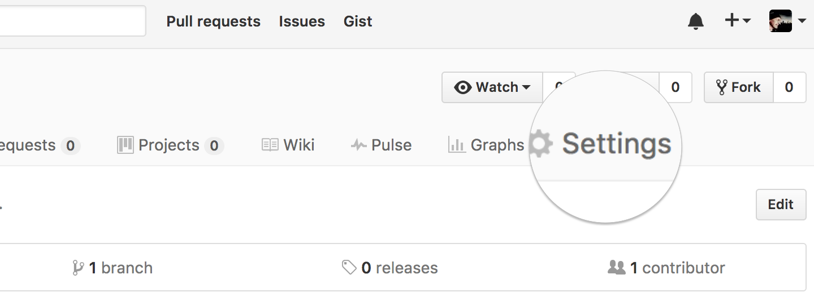

Here's you: You want to make a web page, you don't want to mess with HTML or don't even know what the hell that is, and your budget is approximately zero dollars. Keep reading. 

You'll need;

- An internet-connected computer, tablet or phone
- A second grade education or higher 
- 5 minutes 

Here's some info you don't care about, so skip the following list if you're feeling antsy: 

- [**Git**](https://git-scm.com/) is "version control" software used by computer nerds everywhere.
- In Git, a collection of files is called a **repository** (or, colloquially, a **"repo"**).
- [**GitHub**](https://github.com) ([github.com](https://github.com)) is a service that hosts repositories online.
- [**GitHub Pages**](https://pages.github.com) is a special feature of GitHub that turns a text file into a simple web page.

This page you're looking at right now is a **file** in a **Git repository**, hosted on **GitHub**, served up via **GitHub Pages**. 

Let's get fucking started. 

1. [Sign up for a GitHub account](#signup)
2. [Create a new repository ](#create-a-new-repo)
3. [Activate GitHub Pages and choose a theme](#activate-github-pages)
4. [Add your content](#add-your-content)
5. [You're all done](#check-out-your-page)
6. [Editing your page](#edit-your-content)
7. [Advanced topics](#advanced-topics)

## Create a GitHub account

If you're done this already, fast-forward to step 2.

1\. Visit [githib.com](https://github.com) and "Sign up." You'll need to pick a username, provide an email address and set your password.

2\. Select the free plan. All your repositories will be publicly viewable (but not editable), unless you choose a paid plan.

 No problem with the free/public plan because the only files you'll have will be the text and pictures you want on your web page anyway.

3\. There's a third step you can skip, and they've conveniently provided a "skip this step" link at the bottom.

4\. Lastly, check your email, and confirm your email address.

## Create a new repository

You'll need to make a new repository: a "project" where you keep some files.

After you *first* sign up, you can do this with the "Start a project" button.

If you want to create more projects/repositories later, you can use the green "New" buttons on your profile page or your repositories page.

Once you've reached the "Create a new repository" page, enter the name you want for the repository/project. The description is optional. Go with the defaults on all the other stuff. Then click "Create Repository."

## Activate GitHub Pages and choose a theme

Once you've created the repository, you'll be looking at the contents of your initially-empty repository. Hit the Settings tab.

Scroll down to the GitHub Pages section.

Choose a theme/layout you like, and click Select Theme.

>Note: You can change your theme at any time by visiting the GitHub Pages settings and choosing a different one.

## Add your content

After you choose your theme, GitHub puts a file called **index.md** in your repository and takes you to the page to edit it.

They're nice enough to stick some boilerplate in there to tell you some basics about [Markdown](https://guides.github.com/features/mastering-markdown/), a simple format for writing text. Why fuck around with HTML like some nerd? Stick with this Markdown crap. [Learn it](https://github.com/adam-p/markdown-here/wiki/Markdown-Cheatsheet). Know it. [Live it](https://www.youtube.com/watch?v=P8E7_u2qgjE).

Replace that boilerplate with whatever you want on your page.

To save your changes, scroll down and click the "Commit changes" button. All your life, you've clicked "Save" buttons to save your stuff, but this is nerd territory. Here you're not just "saving" your shit, you're "committing changes" to it. As far as you're concerned, same thing.

## You're done. Check out your page.

After you've saved (no, wait..."comitted") changes, you'll be looking at your **index.md** file in read mode. If you've used Markdown, you can get a preview of what that formatting looks like.

Now you want to view the thing as your actual web page. Hit the Settings tab again, scroll down to the GitHub Pages section again, and you'll see the URL for your page. Click that son of a bitch.

Then you'll be looking at your page.

**Holy crap, you're done.**

