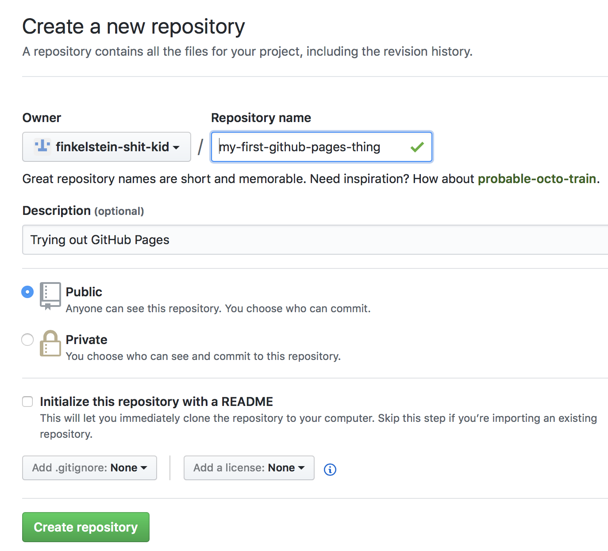

Here's you: You want to make a web page, you don't want to mess with HTML or don't even know what the hell that is, and your budget is approximately zero dollars. Keep reading. 

You'll need;

- An internet-connected computer, tablet or phone
- A second grade education or higher 
- 5 minutes 

Here's some info you don't care about, so skip this paragraph and the next one if you're feeling antsy: [Git](https://git-scm.com/) is "version control" software used by computer nerds everywhere. In Git, a collection of files is called a **repository** (or, colloquially, a **"repo"**). [GitHub](https://github.com) ([github.com](https://github.com)) is a service that hosts repositories online. [GitHub Pages](https://pages.github.com) is a special feature of GitHub that turns a text file into a simple web page.

This page you're looking at right now is a file in a Git repository, hosted on GitHub, served up via GitHub Pages. 

Let's get fucking started. 

1. Sign up for a GitHub account 
2. Create a new repository 
3. Activate GitHub Pages and choose a theme
4. Add your content
5. You're all done
6. Editing your page
7. Advanced topics

## Create a GitHub account

If you're done this already, fast-forward to step 2.

1\. Visit [githib.com](https://github.com) and "Sign up." You'll need to pick a username, provide an email address and set your password.

2\. Select the free plan. All your repositories will be publicly viewable (but not editable), unless you choose a paid plan.

 No problem with the free/public plan because the only files you'll have will be the text and pictures you want on your web page anyway.

3\. There's a third step you can skip, and they've conveniently provided a "skip this step" link at the bottom.

4\. Lastly, check your email, and confirm your email address.

## Create a new repository

You'll need to make a new repository; think of this like a "project" where you keep some files.

In fact, after you first sign up, you can to this with the "Start a project" button.

If you want to create more projects/repositories later, you can use the green "New" buttons on your profile page or your repositories page.

Once you've reached the "Create a new repository" page, enter the name you want for the repository/project. The description is optional. Go with the defaults on all the other stuff. Then click "Create Repository."

## Activate GitHub Pages and choose a theme

Once you've created the repository, you'll be looking at the contents of your initially-empty repository, with a URL something like:

https://githib.com/your-github-username/your-repository-name

